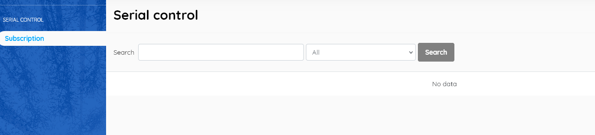
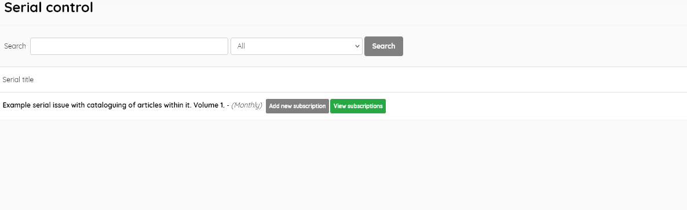
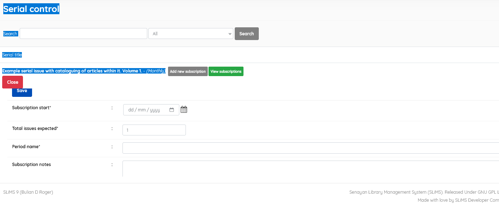

### Serial Control

The Serial Control Module will run if bibliographic data is subscribed for periodical titles.

If there is no bibliographic data in a table that indicates the frequency, this functionality will not work and the screen will look like below:

The information that distinguishes between magazine bibliographic data and other document types is the frequency/time the serial is published. 

When there is frequency data the screen will show the details of the serial titles, similar to below 

An option then exists to *Add new subscription*, and to enter subscription information.

That information is:

- *Subscription Start*: fill in the date the subscription will start to be received at the library.
- *Total Exemplar Expected*: enter the total number you expect to receive in a period of a subscription. E.g to subscribe for a year on a monthly basis insert 12.
- *Period Name*: Name the subscription period to provide differentiation between periods. Also give a name to distinguish copy subscription one, a second subscription, and so on.
- *Subscription Notes*: Insert important or useful notes on the subscription. 
- *GMD*: if necessary, replace it with the appropriate GMD of the item to be subscribed

