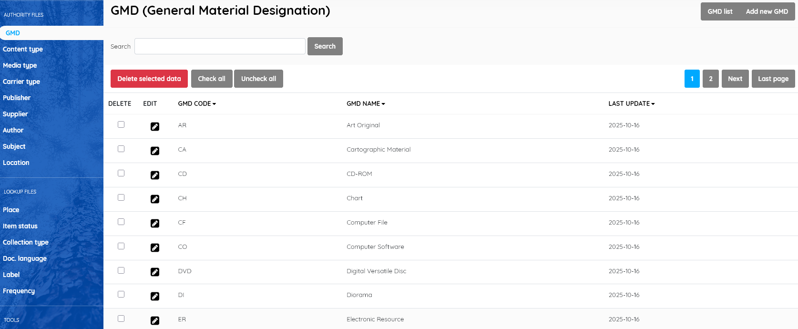
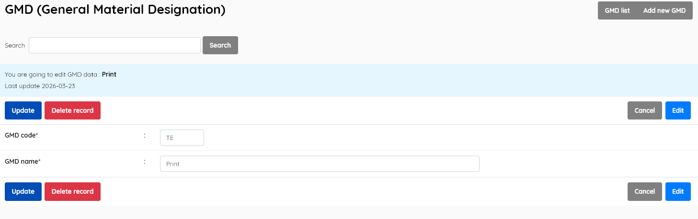

#### This sub-menu is used to manage the GMD authority file .

GMD : General Material Designation – The physical form of the media  item . While this was utilised in AACR2 cataloguing, *it was superseded  in RDA cataloguing by content, media, and carrier terms.*

SLiMS retains this functionality for libraries still using AACR2 standards, but if choosing to use it,  **libraries should adhere to the standard GMDs which are already provided**.

The interface allows sorting by clicking on the head of the columns.

If you wish to edit an entry you must select it , click the little edit pen button, and then on the resulting screen also click the EDIT button to enable editing. It's a type of "safety mechanism".

There is a possible exception to the strong suggestion not to alter the GMD records. If you use Z39.50SRU copy-cataloguing, the Library of Congress will provide a GMD = "print" when you download most book records. That will result in SLiMS creating another GMD entry for "print", and without a GMD code. To avoid this, it is best to EDIT the existing record for "Text". You should retain the GMD code = TE , but edit the GMD name to "Print". This will allow correct GMD insertion for Z39.50 downloads.

SLiMS does not translate master file entries. If you do not choose to use English terms,  you should edit the records in the master-file to the equivalent term in your preferred language. Be aware that if using Z39.50 copy-cataloguing from LOC, downloads will create additional entries in the GMD master-file in English, if SLiMS can't find the GMD NAME in the master-file.

The layout and function of this module interface is similar to other master-file entry/management screens.

