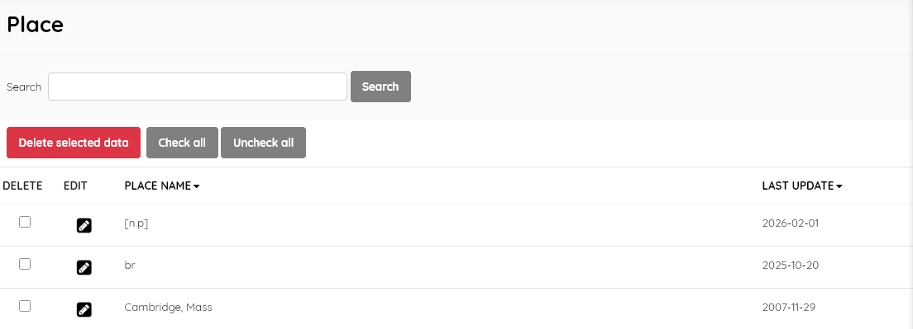
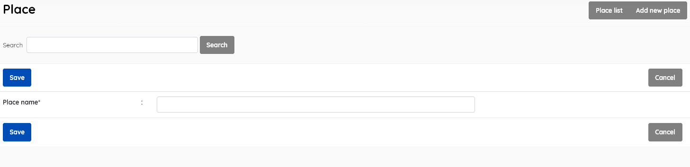
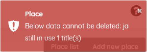

#### This sub-menu is used to manage the Place lookup file .

This look-up table contains the authoritative list of places of publication used in the catalogue.

##### Place list

This function enables management of the place master-file. It  displays the list of places of publication ( e.g Chiang Mai, Thailand ;  Brisbane, Australia etc. )  in the lookup table , with data for:

- *Place name* (authoritative geographic name for the place of publication)
- *Last update* (when the record was last edited)

If you wish to edit an entry you must select it , click the little edit pen button, and then on the resulting screen also click the EDIT button to enable editing. It's a type of "safety mechanism".

A search function allows you to search for entries by place-name keywords.

Results can be sorted by clicking on the field name at the top of each column. 

##### Add new place

This provides the facility to add places directly to the data in the  Senayan system. Places' information includes the fields listed above,  with the exception of *Last updated*, which is done automatically when the **Save** button is clicked.

Adding a place to the master-file can also be done during the  cataloguing data input if the place is not found during the place data  input for a new title.  

SLiMS does not translate master file entries. 

##### Delete place

A place must be selected first, and after clicking the DELETE SELECTED DATA button a requester  will appear, asking for confirmation.

If the place is in use in any existing catalogue records, it cannot be deleted, and a notification will  appear.

The layout and function of this module's interface is similar to other master-file entry/management screens.

**Notes:**

1. *Copy-cataloguing from Library of Congress may introduce strange two or three letter codes, which represent just the country code in MARC (see https://www.loc.gov/marc/countries/countries_code.html)*

   *Such entries will require manual editing.*

2. *The place of publication name should reproduce the place of publication as given on the title page or in other bibliographic data ( e.g C.I.P) provided by the resource.*

