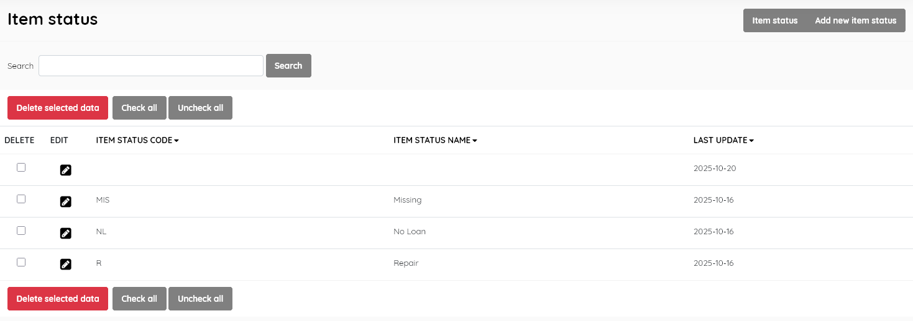
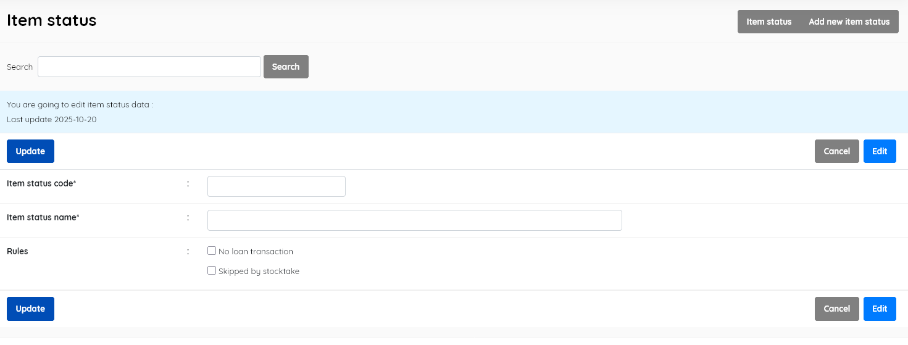

#### This sub-menu is used to manage the Item Status lookup file .

This look-up table contains a set of possible states for an item in the SLiMS system.

The item status function allows library staff to tag items that have a status  that is non-normal, and to have that status impact circulation and stocktake. Examples include "Missing", "Online", "Repair" etc

##### Item status

This enables management of the Item Status master file. It displays  the list of possible item states ( e.g missing, not for loan, repair )  in the SLiMS database , with data for:

- *Item status code* (unique code for the status)
- *Item status name* (description of the status)
- *Last update* (when the record was last edited)

This section is provided with facilities to DELETE  and EDIT item status data.

To edit an status , double-click on the status , or single-click on the pencil (edit) icon.

A search function allows you to search for entries by item status name keywords.

##### Add new item status

This provides the facility to add new item statuses. Item status' information includes the fields listed above, with the exception of *Last updated*, which is done automatically when the **Save** button is clicked.

There are two additional options , to allow you to set *Rules* for the  new status. 

1. Checking the *No loan transaction* box will prevent items with the new status being loaned (e.g. digital/online collections ). 
2. Checking the *Skipped by stocktake* box will remove items with this new status from the stocktake process.

##### Delete Item Status

A status must be selected first, and after clicking the DELETE SELECTED DATA button a requester  will appear, asking for confirmation.

If the Item Status is in use in any existing catalogue records, it cannot be deleted, and a notification will  appear, like below:

**Note:** *As of SLiMS 9.7.2, it is possible for some data imports ( e.g. direct sql file inputs to the database)  to create an <u>empty</u> record in the* **Item Status** *field, as illustrated in the Item Status list above. Such a record cannot be deleted via the master-file module easily*, *nor searched for readily*.  *Such a record can be ignored and left, or removed by resorting to database tools such as phpMyAdmin.*