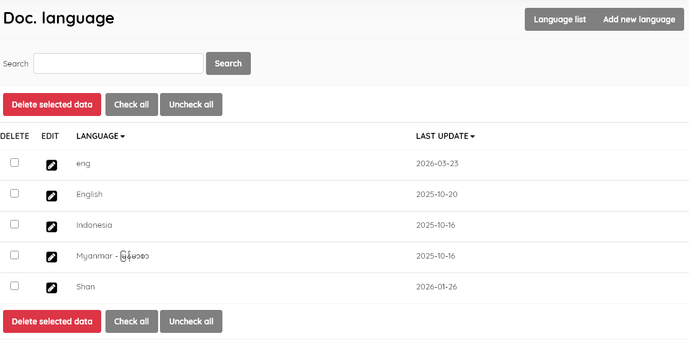
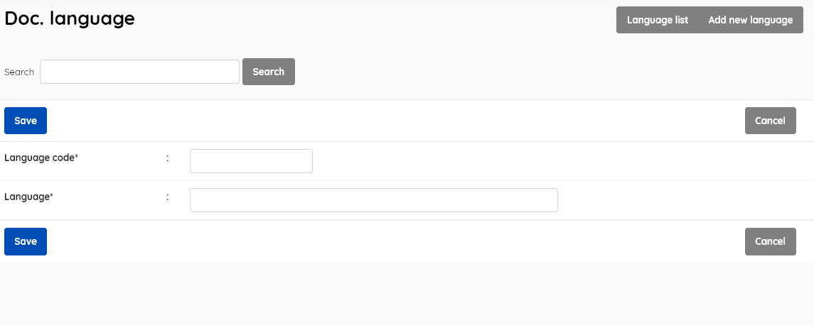

#### This sub-menu is used to manage the Document Language lookup file .

Catalogued resources can be tagged to indicate the main language used. This lookup table holds data on the possible languages 

##### Language list

This enables management of the document language master file. It  displays the list of all languages available for selection when entering data about a document's language in the SLiMS database , with data for:

- *Language* (name of the language)

- *Last update* (when the record was last edited)

  

This section is provided with facilities to DELETE  and EDIT language data.

To edit an item , double-click on the language name , or single-click on the pencil (edit) icon.

A search function allows you to search for entries by keywords.

Results can be sorted by clicking on the field name at the top of each column. 

##### Add new language

This provides the facility to add new document languages directly to the Senayan system. 

You must allocate a language code as well as the name of the language. The language code *should* be the ISO 639-2 or 3 code for the language you enter. These codes are detailed at : https://www.iso.org/iso-639-language-codes.html There is a more limited Library of Congress authority list at: https://www.loc.gov/marc/languages/language_code.html , which will ensure MARC compatibility.

*Notes:* 

1. *Copy cataloguing using Z39.50 data from the Library of Congress could insert a new language code into this table, but it may be inaccurate . In this case, create a new correct Document language entry, and then assign it to the title being catalogued, and delete the incorrect language.*
2. *This is a lookup file for describing the language that a  resource has been authored in. It does not affect the translation  languages available for the SLiMS OPAC or administration interface.*

SLiMS does not translate master-file entries. So, while you should adhere to the language CODE (as advised above), you may enter a language name in translated form to meet user needs.

##### Delete document language

A document language must be selected first, and after clicking the DELETE SELECTED DATA button a requester  will appear, asking for confirmation.

If the document language is in use in any existing catalogue records, it cannot be deleted, and a notification will  appear.

