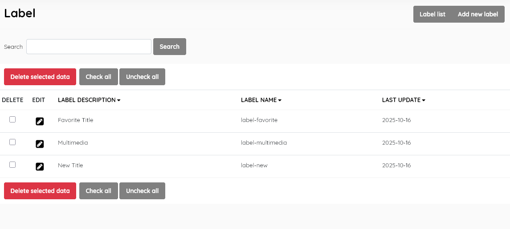
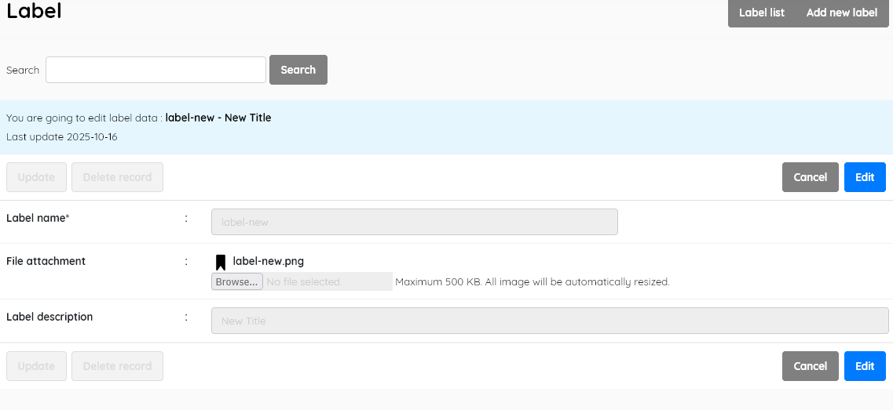

#### This sub-menu is used to manage the Label lookup file .

To provide specific information about a catalogued resource,  labels  can be defined using the label master-file function. These labels are  primarily used to provide visual cues , and potentially hyperlinks, in  the SLiMS OPAC. ***Some OPAC Themes DO NOT display Labels, but this data table is retained for compatability***

##### Label list

This function enables management of the label master-file. It  displays the list of labels ( e.g New title, favourite title,   multimedia )  in the lookup table , with data for:

- *Label description* (description of the status seen by users)

- *Label name* (unique name for the label, used internally by SLiMS, in the form *label-xyz*)

- *Last update* (when the record was last edited)

  

This section is provided with facilities to DELETE  and EDIT label data.

To edit a label , double-click on the label , or single-click on the pencil (edit) icon.

A search function allows you to search for entries by label keywords.

Results can be sorted by clicking on the field name at the top of each column. 

##### Add new label

This provides the facility to add labels directly to the data in the  Senayan system. Labels' information includes the fields listed above,  with the exception of *Last updated*, which is done automatically when the **Save** button is clicked.

Adding or editing a label also provides a *File attachment* facility,  to install a graphic file to act as an icon for the label. The image should be in PNG format. In SLiMS 9.x the label graphic will be uploaded to */images/labels/* . The default images should be used as a guide for the size, style, and **naming** of any additional labels. The screenshot above shows the edit interface, to illustrate the <u>naming convention</u>.

**Delete label **

A label must be selected first, and after clicking the DELETE SELECTED DATA button a requester  will appear, asking for confirmation.

If the label is in use in any existing catalogue records, it cannot be deleted, and a notification will  appear.

