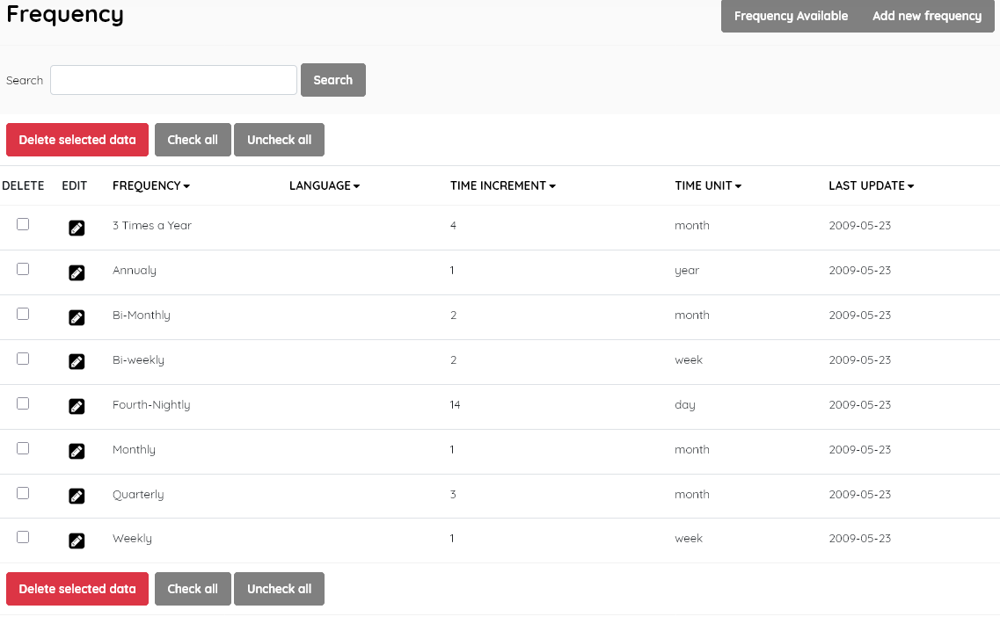

#### This sub-menu is used to manage the Frequency table .

Lists the lookup frequencies for <u>serial publications</u>, such as journals and newspapers. SLiMS comes with most common frequencies for serial publications, as shown in the screenshot below.

##### Frequency available

Displays the list of available frequencies in the lookup table, with data for:

- *Frequency* (text description of the frequency)

- *Language* (optional, specifies the language from the available document languages)

- *Time increment* (the interval between issues in time units)

- *Time unit* ( day/week/month/year)

- *Last update* (when record was last edited)

  

This section is provided with facilities to DELETE  and EDIT frequency data.

To edit an item , double-click on the frequency, or single-click on the pencil (edit) icon.

A search function allows you to search for entries .

Results can be sorted by clicking on the field name at the top of each column. 

**Add new frequency**

This provides the facility to add new frequencies directly to the  data in the SLiMS system. Frequency information includes the fields  listed above, with the exception of *Last updated*, which is done automatically when the **Save** button is clicked.

##### Delete frequency

A frequency must be selected first, and after clicking the DELETE SELECTED DATA button a requester  will appear, asking for confirmation.

If the frequency is in use in any existing catalogue records, it cannot be deleted, and a notification will  appear. *It is recommended that you don't delete the default frequencies, as they may be required for future acquisitions.*

