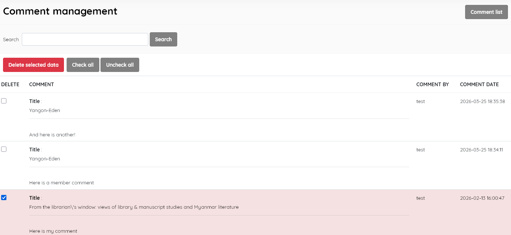

#### This sub-menu is used to manage the user Comments .

Where the system allows signed-in members to leave comments and/or reviews in the OPAC for particular titles, this menu option allows library staff to manage comments.

**Comment list**

Displays the list of comments, with data for:

- *Comment* (includes the Title the comment relates to, and the content of the comment)

- *Comment by*  (holds the name of the member who made the comment)

- *Comment  date* ( the date the comment was entered)

  
  
  
  
  This section is provided with facilities to DELETE  comments. There is no provision for staff to edit comments.

To edit an item , double-click on the comment, or single-click on the pencil (edit) icon.

A search function allows you to search for entries .

Results can be sorted by clicking on the field name at the top of each column. 

