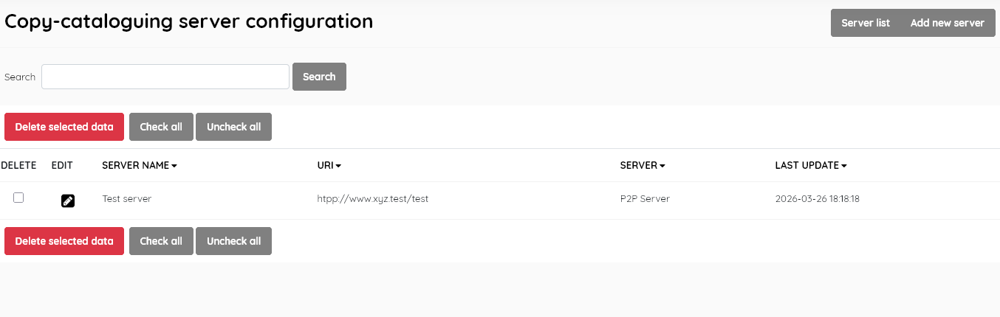
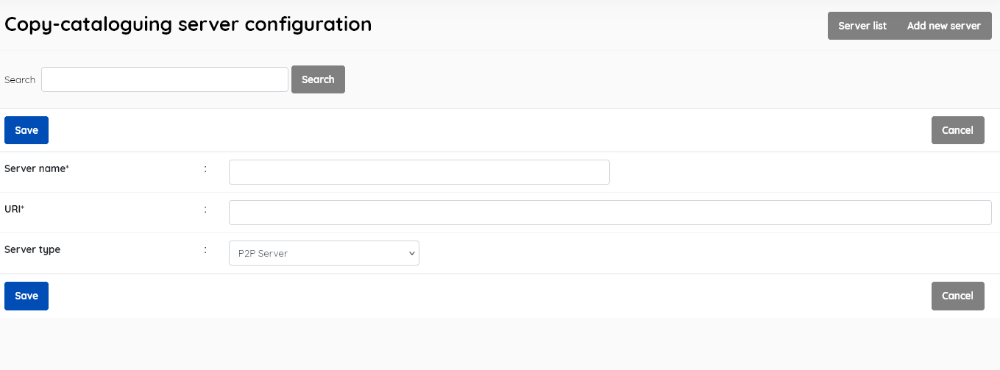

#### This sub-menu is used to manage the Cataloguing Servers .

While SLiMS comes with a default setting for MARC SRU [ https://opac.perpusnas.go.id/sru.aspx] , and Z39.50 SRU [http://z3950.loc.gov:7090/voyager] , and the default P2P pointing at itself, provision is also made for setting up connections to other catalogue servers.

**Server list**

Displays the list of user servers, with data for:

- *Server name* (user-friendly name chosen by librarian)

- *URI*  ( holds the address of the server )

- *Server* ( the server type: P2P, Z3950 , Z3950 SRU, MARC SRU)

- *Last Update*

  
  

This section is provided with facilities to DELETE  and EDIT server data.

To edit an item , double-click on the server name , or single-click on the pencil (edit) icon.

A search function allows you to search for entries by keywords.

Results can be sorted by clicking on the field name at the top of each column. 

##### Add new server

This provides the facility to add new cataloguing servers directly to the Senayan system. 

Complete each field, choosing the server type from the drop-down list, then click the SAVE button. 

Once a server has been added, it will be available in the appropriate copy-cataloguing method, as an item in the dropdown list to choose which server to use.