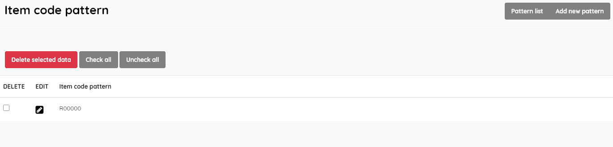

#### This sub-menu is used to manage the Item Code Patterns .

SLiMS has provision for Item Codes, generally in the form of Barcodes, to be allocated to each item to facilitate automated circulation. The format(s) of the code can managed by this sub-menu.

**Pattern list**

Displays the list of patterns, with data for:

- *Item code pattern*

  

  

This section is provided with facilities to DELETE  and EDIT pattern data.

To edit an item , double-click on the pattern name , or single-click on the pencil (edit) icon.

A search function allows you to search for entries by keywords.

Results can be sorted by clicking on the field name at the top of each column. 

##### Add new pattern

This provides the facility to add new patterns directly to the SLiMS system. 

Complete each field then click the SAVE button. The Prefix and Suffix fields are constants that will appear in each code generated. The Serial Number length default is 5. This would be sufficient to service a collection of 1 million items.  A preview shows the first composite code.

Once a pattern has been added, it will be available to choose in the cataloguing module when allocating barcodes to items, as an item in the dropdown list for the *Item(s) code batch generator*. The "Item(s) code batch generator" is recommended as the normal method to allocate barcodes, as it will automatically increment the serial number, and relieve staff of tracking the next code to allocate.

.