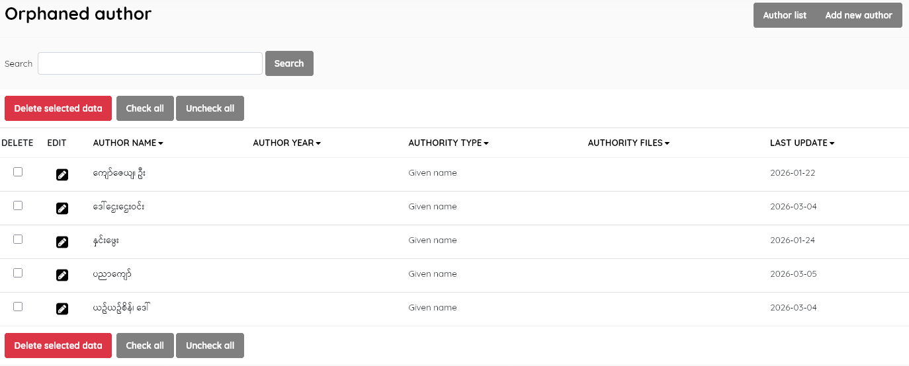

## Orphaned Author, Orphaned Subject, Orphaned Publisher, Orphaned Place. 

#### These sub-menu items are used to manage orphaned entries in the database .

Over time, titles may be deleted from the catalogue, and as a result entries in the master-files of Author, Subject, Publisher or Place may remain without any link to a resource held by the library. If staff wish to unclutter these master-files, the "orphaned" data entries can be identified with these tools, and deleted if considered no longer needed.

The operation is the same for each tool to find orphaned entries in its master-file.

Choosing the menu item, e.g Orphaned Author, will open the relevant list interface ( e.g Author List ), which has the same appearance as the usual master-file list, ***but displays just those entries which are orphaned***. 

Example: *Orphaned Author* display list

The orphaned entries that you decide should be removed can be selected and deleted in the normal fashion.

