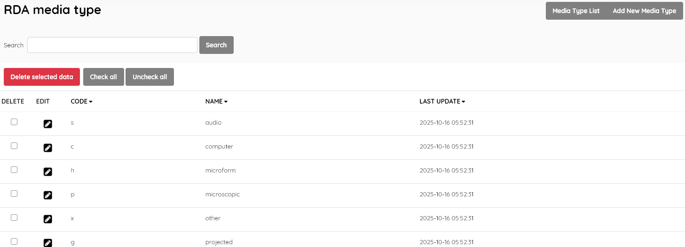

#### This sub-menu is used to manage the Media Type authority file .

**RDA Media Type definition:** Categorizes library materials based on the general type of device  (intermediation tool) required to view, play, or run the content, such  as audio, computer, video, or unmediated.

**Examples:** Audio, computer, video.

SLiMS comes with standard authoritative codes and Media Type names. It is **strongly recommended** that you only edit this master file if there has been a change in the official standards [ seehttps://www.loc.gov/standards/valuelist/rdamedia.html ] . Do not delete entries.

If you wish to edit an entry you must select it , click the little edit pen button, and then on the resulting screen also click the EDIT button to enable editing. It's a type of "safety mechanism".

SLiMS does not translate master file entries. If you do not choose to use English terms,  you should edit the Media Type **Name** in the master-file to the equivalent term in your preferred language. Do not alter the  single-character codes.

The layout and function of this module's interface is similar to other master-file entry/management screens.

