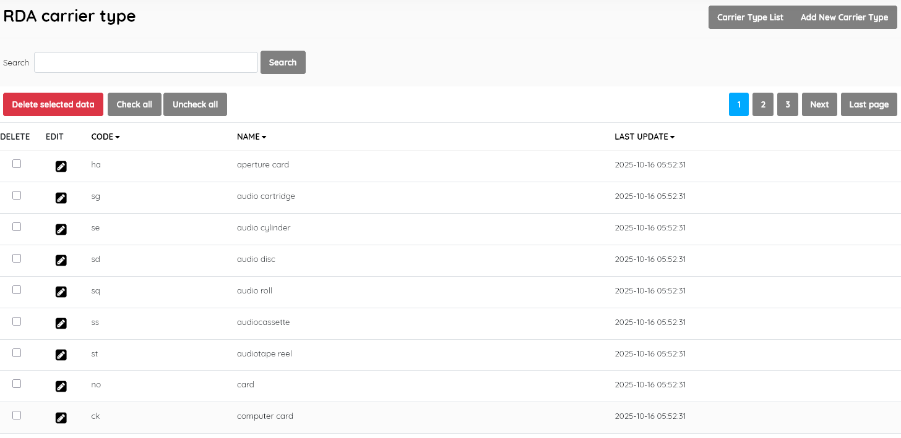

#### This sub-menu is used to manage the Carrier Type authority file .

**RDA Carrier Type definition:** These are categorized formats describing the physical storage medium and housing of a  resource, combined with the intermediation device needed to view or play it.

**Examples:** videodisc, volume, online resource, etc.

SLiMS comes with standard authoritative codes and Carrier Type names. It is **strongly recommended** that you only edit this master file if there has been a change in the official standards [ see https://www.loc.gov/standards/valuelist/rdacarrier.html ] . Do not delete entries.

If you wish to edit an entry you must select it , click the little edit pen button, and then on the resulting screen also click the EDIT button to enable editing. It's a type of "safety mechanism".

SLiMS does not translate master file entries. If you do not choose to use English terms,  you should edit the Carrier Type **Name** in the master-file to the equivalent term in your preferred language. Do not alter the  two-character codes.

The layout and function of this module's interface is similar to other master-file entry/management screens.

