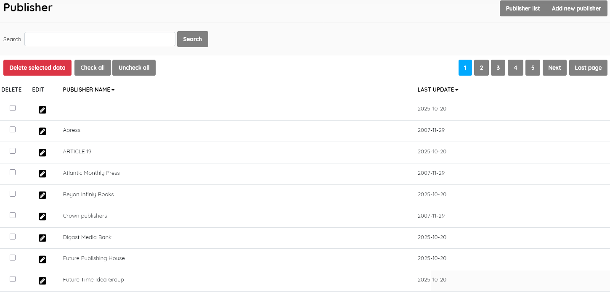
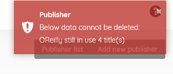

#### This sub-menu is used to manage the Publisher authority file .

 This look-up table contains the authoritative list of publishers used in the catalogue.

##### Publisher list

This function enables management of the publisher master-file. It  displays the list of publishers ( e.g Penguin , CSIRO Publishing, etc )  in the lookup table , with data for:

- *Publisher name* (authoritative name of the publisher)

- *Last update* (when the record was last edited)

  

  

This section is provided with facilities to DELETE, ADD, and EDIT publisher data.

If you wish to edit an entry you must select it , click the little edit pen button, and then on the resulting screen also click the EDIT button to enable editing. It's a type of "safety mechanism".

A search function allows you to search for entries by publisher keywords.

Results can be sorted by clicking on the field name at the top of each column. 

##### Add new publisher

This provides the facility to add publishers directly to the data in  the Senayan system. Publishers' information includes the fields listed  above, with the exception of *Last updated*, which is done automatically when the **Save** button is clicked.

Adding a publisher to the master-file can also be done during the  cataloguing data input for a new title if the publisher is not found to  exist in the master-file during the publisher data input. In that case,  the option to *Add* the publisher will be presented to the  cataloguer, so care should be taken to enter data correctly as the name  will then be added to the master-file.

SLiMS does not translate master-file entries. Data is displayed as it has been entered.

##### Delete publisher

A publisher must be selected first, and after clicking the DELETE SELECTED DATA button a requester  will appear, asking for confirmation.

If the Publisher Name is in use in any existing catalogue records, it cannot be deleted, and a notification will  appear, like below:

**Note:** *As of SLiMS 9.7.2, it is possible for copy-cataloguing or other data imports ( e.g. direct sql file inputs to the database)  to create an <u>empty</u> record in the* **Publisher Name** *field, as illustrated in the Publisher List above. Such a record cannot be deleted via the master-file module easily*, *nor searched for readily*. As a workaround,  select EDIT and then insert a character such as "." or "_",  as the Publisher Name. It should SAVE successfully. You can then search for any catalogue records using that publisher name. Alternatively, such a record can be ignored and left, or removed by resorting to database tools such as phpMyAdmin.