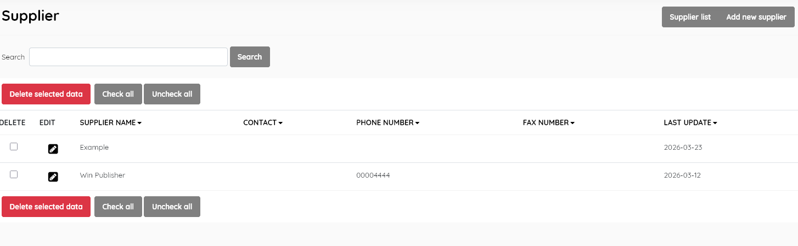
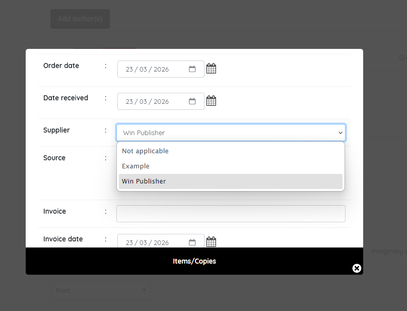
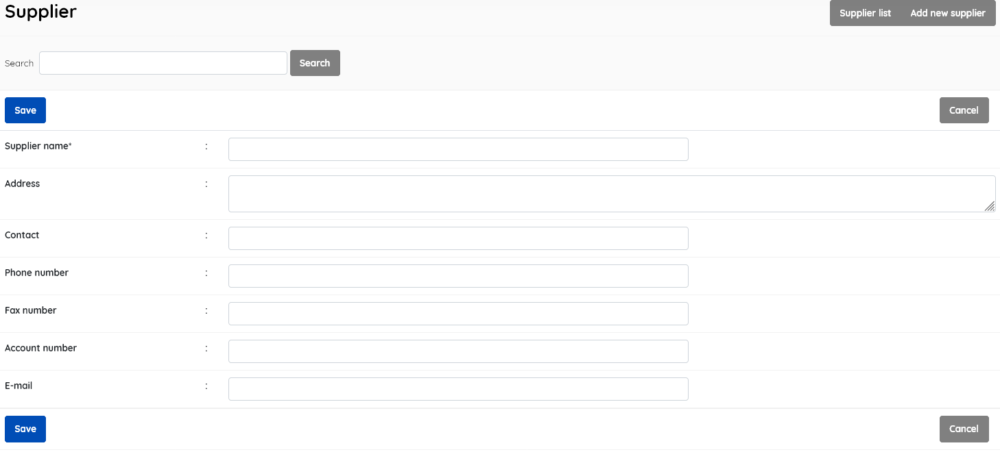

#### This sub-menu is used to manage the Supplier authority file .

 This look-up table contains the authoritative list of suppliers used in the system to record acquisitions.

##### Supplier list

This function enables management of the supplier master-file. It  displays the list of suppliers e.g individual bookstores, Amazon etc.  in the lookup table , with data for:

- *Supplier name*
- *Contact*
- *Phone number*
- *Fax number*

- *Last update* (when the record was last edited)

  

This section is provided with facilities to DELETE, ADD, and EDIT supplier data.

To edit a supplier , double-click on the supplier , or single-click on the pencil (edit) icon.

When you edit a supplier, you will also have access to additional fields:

- *Address*
- *Account number*
- *Email Address*

A search function allows you to search for entries by supplier keywords.

Results can be sorted by clicking on the field name at the top of each column. 

Maintaining a list of suppliers facilitates ordering and reordering of resources, and creating an entry for a supplier in this master-file allows for the supplier to appear in the drop-down Supplier list when adding an Item (copy) of a title, during cataloguing.

##### Add new supplier

This provides the facility to add suppliers directly to the data in  the Senayan system. Suppliers' information includes **all** of the fields listed  above, with the exception of *Last updated*, which is done automatically when the **Save** button is clicked.

##### Delete supplier

A supplier must be selected first, and after clicking the DELETE SELECTED DATA button a requester  will appear, asking for confirmation.

