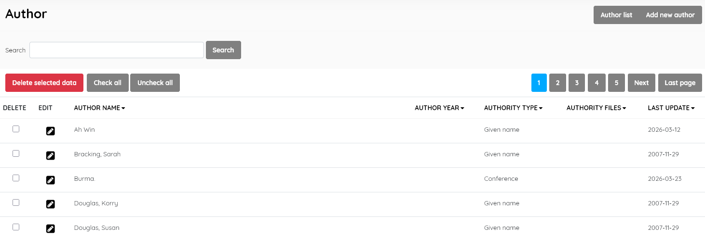
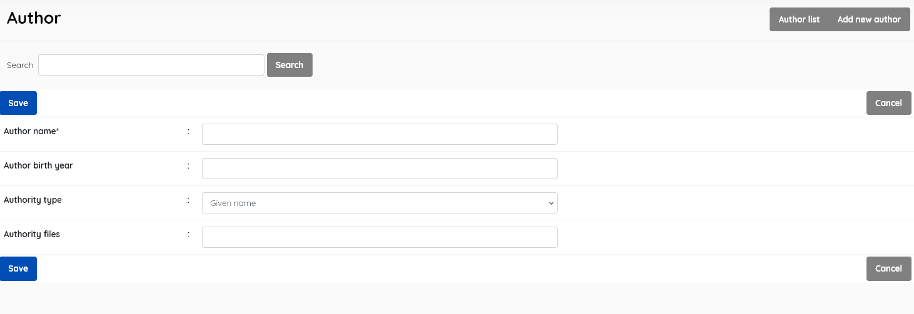

#### This sub-menu is used to manage the Author authority file .

This look-up table contains the authoritative list of Authors used in the catalogue.

This menu enables management of the Authors master file. It displays the list of all authors in the SLiMS database , with data for:

- *Author name* (name of the author)
- *Author year* (birth year of the author)
- *Authority type* (can be person/organisation/conference, and corresponds to MARC 1XX fields)
- *Authority files* (source, eg. Library of Congress, MLA authority, etc)
- *Last update* (when record was last edited)

This section is provided with facilities to DELETE  and EDIT author data.

If you wish to edit an entry you must select it , click the little edit pen button, and then on the resulting screen also click the EDIT button to enable editing. It's a type of "safety mechanism".

A search function allows you to search for entries by author-name keywords.

Results can be sorted by clicking on the field name at the top of each column. 

##### Add new author

This provides the facility to add authors directly to the data in  the Senayan system. Authors' information includes the fields listed  above, with the exception of *Last updated*, which is done automatically when the **Save** button is clicked.

Adding an author to the master-file can also be done during the  cataloguing data input for a new title if the author is not found to  exist in the master-file during the author data input. In that case,  the option to *Add* the author will be presented to the  cataloguer, <u>so care should be taken to enter data correctly as the name  will then be added to the master-file.</u>

SLiMS does not translate master-file entries. Data is displayed as it has been entered.

##### Delete author

An author must be selected first, and after clicking the DELETE SELECTED DATA button a requester  will appear, asking for confirmation.

If the author name is in use in any existing catalogue records, it cannot be deleted, and a notification will  appear.

