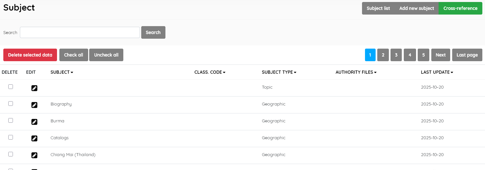
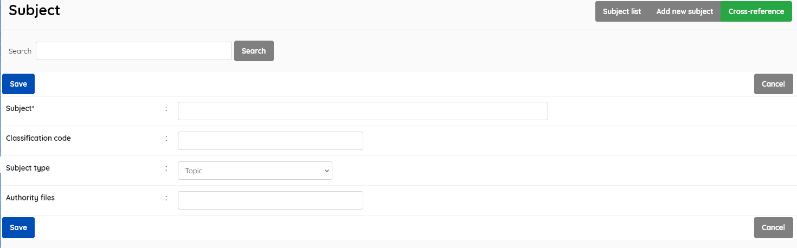
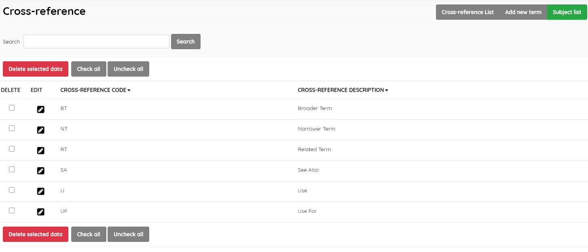
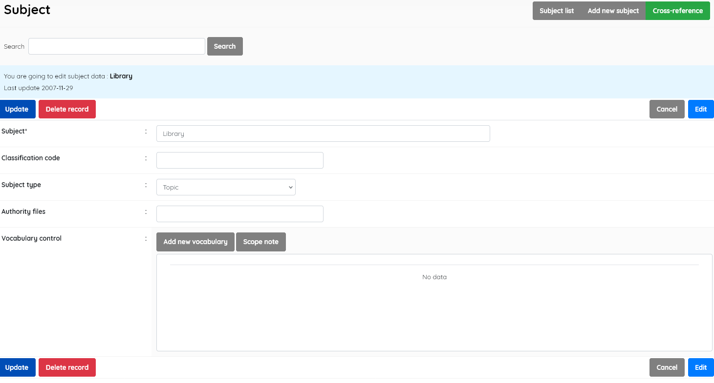
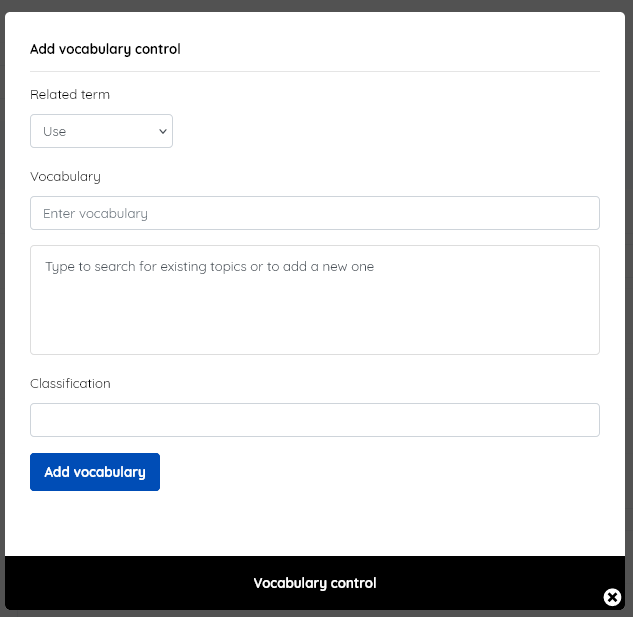
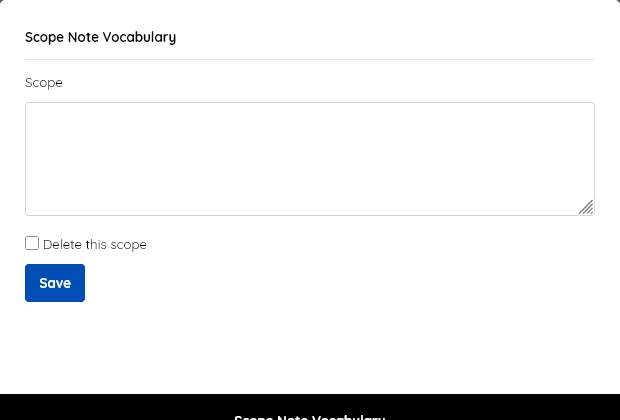

#### This sub-menu is used to manage the Subject authority file .

This look-up table contains the authoritative list of subjects used in the catalogue along with cross-referencing.

##### Subject list

This enables management of the subjects master-file. It displays the list of all subjects in the SLiMS database , with data for:

- *Subject* 
- *Class. code* (optionally allocate a classification code)
- *Subject type* (Topic/Geographic/Name/Temporal/Genre/Occupation)
- *Authority files* (source, eg. Library of Congress )
- *Last update* (when record was last edited)

This section is provided with facilities to DELETE  and EDIT subject data and options to ADD a new subject or create Cross-reference entries.

If you wish to edit an entry you must select it , click the little edit pen button, and then on the resulting screen also click the EDIT button to enable editing. It's a type of "safety mechanism".

A search function allows you to search for entries by subject keywords.

Results can be sorted by clicking on the field name at the top of each column. 

##### Add new subject

This provides the facility to add subjects directly to the data in  the Senayan system. Subject information includes the fields listed  above, with the exception of *Last updated*, which is done automatically when the **Save** button is clicked.

Adding a subject to the master-file can also be done during the  cataloguing data input for a new title if the subject is not found to  exist in the master-file during the subject data input. In that case,  the option to *Add* the subject will be presented to the  cataloguer, <u>so care should be taken to enter data correctly as the subject will then be added to the master-file.</u>

SLiMS does not translate master-file entries. Data is displayed as it has been entered.

------

##### Cross reference

This button opens another screen to give access to functions managing cross-reference codes and descriptions only. **SLiMS already has the  essential cross-reference terms installed, and it should not normally be necessary to alter or add to these**.

##### Vocabulary control

To implement cross-referencing / vocabulary control, **EDIT** existing subjects. The edit screen provides access to *Vocabulary control* data entry.

 The *Add new vocabulary* button will open a pop-up , which then allows subject cross-references to be created.

 The *Scope note* button will open a pop-up , which then allows a scope note to be entered.
 References and scope notes can be edited or deleted.

##### Delete subject

A subject must be selected first, and after clicking the DELETE SELECTED DATA button a requester  will appear, asking for confirmation.

If the subject is in use in any existing catalogue records, it cannot be deleted, and a notification will  appear.

**Note:** *As of SLiMS 9.7.2, it may be possible for copy-cataloguing or other data imports ( e.g. direct sql file inputs to the database)  to create an <u>empty</u> record in the* **Subject** *field. Such a record cannot be deleted via the master-file module easily*, *nor searched for readily*. As a workaround,  select EDIT and then insert a character such as "." or "_",  as the subject. It should SAVE successfully. You can then search for any catalogue records using that subject. Alternatively, such a record can be ignored and left, or removed by resorting to database tools such as phpMyAdmin.