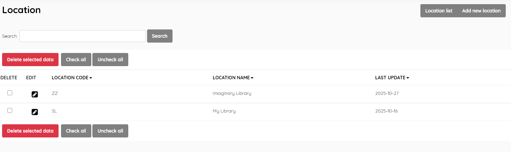

#### This sub-menu is used to manage the Location authority file .

Location  information in SLiMS is used to indicate  resources that might be  located together in a particular building or branch of the library.

##### Location list

This function enables management of the location master-file. It  displays the list of possible locations ( e.g Engineering faculty  library )  in the SLiMS database , with data for:

- *Location code (*unique code for the location)

- *Location name* (description of the location)

- *Last update* (when the record was last edited)

  

This section is provided with facilities to DELETE  and EDIT location data.

To edit a location , double-click on the location , or single-click on the pencil (edit) icon.

A search function allows you to search for entries by location name keywords.

Results can be sorted by clicking on the field name at the top of each column. 

##### Add new location

This provides the facility to add new locations directly to the data  in the Senayan system. Locations' information to be entered includes the fields listed above, with the exception of *Last updated*, which is done automatically when the **Save** button is clicked.

SLiMS does not translate master-file entries. Data is displayed as it has been entered.

The layout and function of this module's interface is similar to other master-file entry/management screens.

