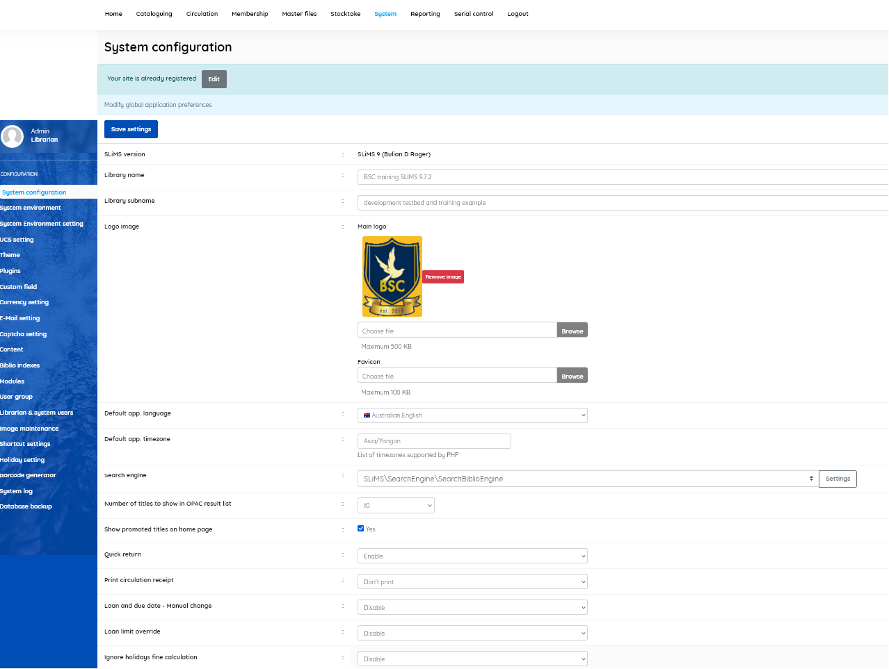

### System configuration

------

Using this form you can make changes to the global preferences in SLiMS applications, such as:
- **Library name** (Name of library, appears in OPAC and printed items such as labels and cards)
- **Library sub-name** (Additional library name, optional)
- **Logo image** (Library logo image file, can be uploaded, may be used in OPAC and member cards)
- **Default application language** (Language that Admin. modules are displayed in, and is OPAC default)
- **Default application timezone** (These must be timezones supported by PHP)
- **Search engine** (Choose search engine, and configure if allowed)
- **Number of titles to show in OPAC result list** (Number of titles that will be displayed on every page in the OPAC)
- **Show promoted titles on homepage** (Showing title of resource in the home page of the OPAC)
- **Quick return**  [Enable/Disable] (to allow the return of items via a quick method; default=Enable)
- **Print circulation receipt** [Print/Don't print] (default= Don't print)
- **Loan and due date - Manual change** [Enable/Disable] (default = Disable)
- **Loan limit override**  [Enable/Disable] (ability for staff to override limits; default=Disable)
- **Ignore holidays fine calculation** [Enable/Disable] (whether to count holidays in calculating fines; default=Disable)
- **OPAC XML detail** [Enable/Disable] (allow XML display of title detail; default=Enable)
- **OPAC XML result** [Enable/Disable] (allow XML display of search results; default=Enable)
- **Enable SEARCH spellchecker** [Enable/Disable] (default=Enable)
- **Allow OPAC file download** [Allow/Forbid]   (allow/forbid users to download title file attachments)
- **Session login timeout** ( set time before a logged-in user is automatically logged out)
- **Remember me Timeout**  ( days before the "remember me" token will expire)
- **Barcode encoding** [ Code 128/Code 38] (set the encoding system used for barcodes)
- **Visitor counter by IP** [Enable/Disable] ( enabling will restrict which IP's can access the visitor page)
- **Allowed counter IP** ( allowed IP address for counter - default is 127.0.0.1)
- **Visitor limitation by time**  [Enable/Disable]
- **Time visitor limitation** [in minutes] (limits visitor to set time, if limitation is enabled)
- **Reserve method** [Database/Email]. ( default is Database ). *Sets method for making reservations.*
- **Reserve for item on loan only** [Enable/Disable] ( allow reservation only for those items that are  already  loaned)
- **Activate confirm alert?**[ [Enable/Disable] (default=Enable)
- **Ignore SSL verification** [Enable/Disable] (Allow insecure http connection; default=Enable)
- **To make a simple search even simpler, narrowing the search criteria.** [No/Yes]  (default is No)
- **Strong password policy** [Yes/No]  (default is Yes. Enforces minimum password requirements)
- **Password minimum characters (if strong password policy is Yes)** ( set number of characters, default = 8)

In this screen  we can also see which version of SLiMS we are using.

*Notes:* **Show promoted titles on homepage** feature on this system: if the check box is checked, the front page of the OPAC display will not show titles, unless there is a set of bibliographic data to display on the front page. See the **Add new entry** menu in the *Cataloguing* module, and the setting "Promote to Homepage"

##### IMPORTANT

When you have altered the System configuration, be sure to click the **Save settings** button before exiting <u>or changes will be lost.</u>

