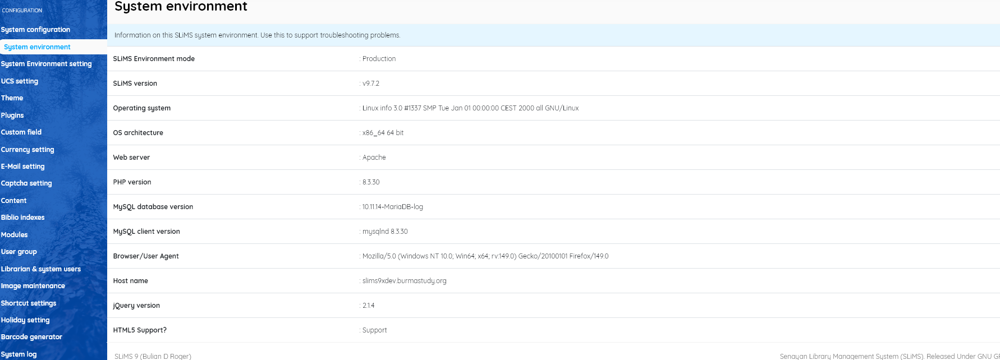

### System environment

------

This menu item will display a screen of details of the current environment in which SLiMS is running. This is extremely important for trouble-shooting and these details should always be included when asking for community support.

