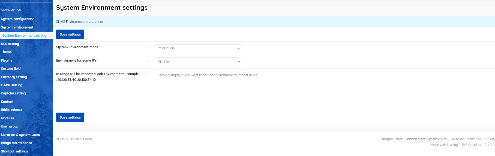

### UCS configuration

------

This menu item allows the setting of preferences for Union Catalog Server usage. Unless you are using a Union Catalog server, you may leave all settings to default.

* **Enable UCS** [Enable/Disable] (default=Disable)
* **Auto delete record** [Enable/Disable] (default=Disable) - *Automatically synchronise* 
* **Auto insert record** [Enable/Disable] (default=Disable) - *Automatically synchronise* 
* **Server address** (default = http://localhost/ucs) *- the address of your Union Catalog server*
* **Server ID** (default = slims-node) *− identifies server*
* **Server password** ( a long password is provided by default - you should alter it)
* **Server name** (default = your library's name)

Don't forget to SAVE settings before leaving the page

