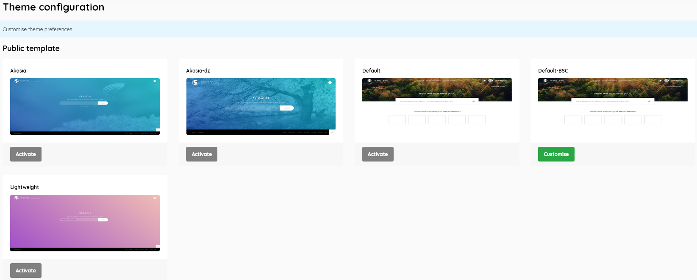
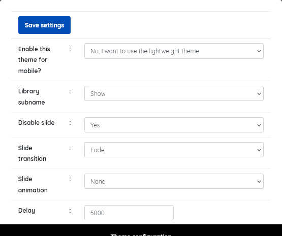
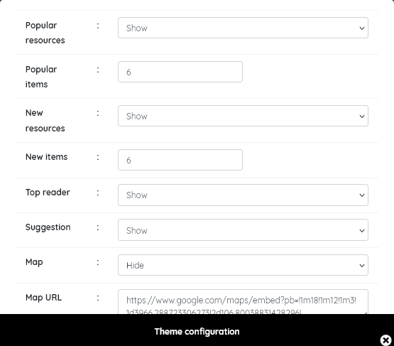
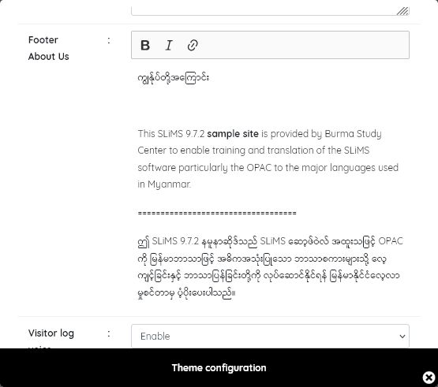
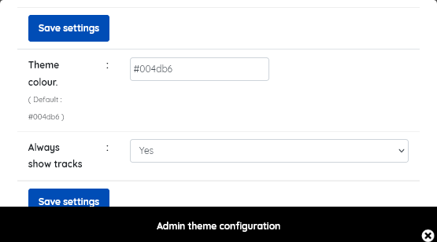

### Theme configuration

------

This menu item enables the configuration of both the **OPAC** and **Admin** themes, which deliver the look and feel of the interface.

##### Public template

This determines how the OPAC appears to users.

Standard themes for the OPAC that are provided are "Akasia", "Akasia-dz" (from version 8 of SLiMS), "default" ( Bulian fresh theme), and "Lightweight" ( which is particularly suited to mobile device clients and low bandwidth environments). Libraries can easily develop their own themes based upon these.

Themes can generally be configured, after they are selected by clicking on the *Activate* button. At that point the button will change to Customise. Clicking the Customise button will open a pop-up with a range of settings.

The screenshots above show the range of customisations for the <u>default</u> theme. Most are self explanatory. Other themes have reduced customising options. 

When you have configured the theme, be sure to click **Save Settings**.

**Important notes:**  *If the default theme is customised and then subsequently another theme is tried, the customisation details are lost. It is recommended in particular that you take a copy of any custom google map data, and custom footer information before changing themes.*

*In SLiMS 9.7.2 the default template options suggest you can change the number of Popular and New items shown in the OPAC. However this is not functional and 6 will always be displayed in the OPAC.*

**Admin template**

This determines  the appearance of the admin. interface that library staff work with.

Customisation is limited.

------

Additional themes can be created by the SLiMS community, and some may be found at : <a href="https://go.slims.id/?page_id=583&skw=template&orderby=date&order=desc" 
   onclick="const w=800;const h=600;window.open(this.href,'newwindow','width='+w+',height='+h+',left='+(screen.availWidth-w)+',top='+((screen.availHeight-h)/2)+',resizable=yes'); return false;" style="color: purple; text-decoration: underline;">
   <u>🔗Go SLiMS
</u></a>

If you wish to create  your own theme, it's recommended that you take a copy of the default theme as a basis for modification