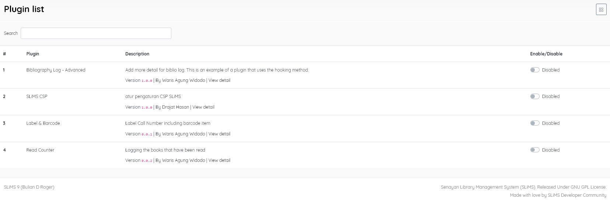

### Plugin list

------

This menu item displays available plugins that have been installed in the SLiMS system, and allows you to **Enable/Disable** them individually. Data displayed is:

* **Plugin** (plugin name)
* **Description** (brief explanation of  what the plugin does, its version, the author, and a link to more details)
* **Enable/Disable** (default=Disabled)

<u>Note:</u>

Plugins are small additions which can be selectively installed in SLiMS to provided added functions to the core system. They are placed in the /*plugins*/ directory and will then appear in this list. Some simple plugins are provided by default. [ *This plugin system is an innovation introduced in SLiMS Bulian 9.3.0 by Mas Ido Alit. The goal of this innovation is to simplify the work of SLiMS developers ,both users and those assisting users, in upgrading SLiMS from the current version to a more advanced one.*]

The method for creating plugins for SLiMS9.3X is documented at: https://slims.web.id/docs/development-guide/Plugin/Intro 

------

Some "plugins" for earlier versions of SLiMS are available at : https://go.slims.id/?page_id=583&skw=plugin&orderby=date&order=desc . These may not be compatible with the latest versions of SLiMS, and cannot be managed by this menu.

