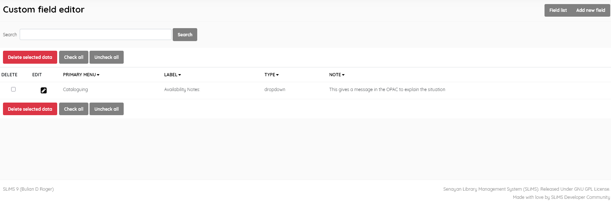
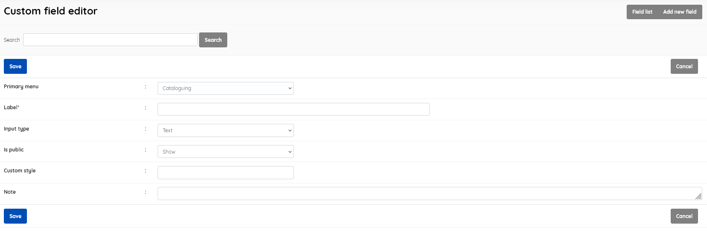

#### Custom field editor

------

This menu item allows the creation of additional custom fields within certain tables in the database, adding submenu items in **Bibliographic** , **Item**, and **Membership** areas of SLiMS.

For a custom field, you can specify

* **Primary menu** [Cataloguing/Catalogue item/Membership] (default=Cataloguing)
* **Label** - *required, as this is the name of the field*
* **Input type** [Text/Text area/Numeric/Drop-down/Check-list/Choice/Date]
* **Is public** [Show/Hide] (default=Show) - *whether the field is visible in OPAC*
* **Custom style** []
* **Note** - *Text area for documenting the field function etc*

This section is provided with facilities to DELETE  and EDIT custom field data. 

If you wish to edit an entry you must select it , click the little edit pen button, and then on the resulting screen also click the EDIT button to enable editing. It's a type of "safety mechanism".

Editing an existing field will delete any existing data in the associated table(s).

A search function allows you to search for custom fields by Label keywords.

Results can be sorted by clicking on the field name at the top of each column. 

##### Add new field

This provides the facility to add fields to the database in the SLiMS system. Field information includes the aspects listed  above, 

SLiMS will not translate your custom field *Label* without additional work on the translation files. Data is displayed as it has been entered.

##### Delete custom field

A custom field must be selected first, and after clicking the DELETE SELECTED DATA button a requester  will appear, asking for confirmation.

