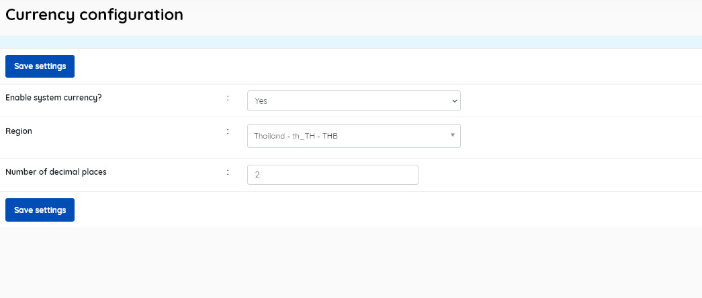

### Currency configuration

------

This menu item allows the setting of the system-wide currency if desired.

* **Enable system currency?** [Yes/No/] (default = Yes).  Currency options will also be affected by the array configured in *sysconfig.inc.php*
* **Region** [Choose from a dropdown list] . *This is reliant on the PHP "intl" extension being enabled and functioning.*
* **Number of decimal places** (default = 0). Allows for currencies that may require decimal divisions for accurate pricing.

Be sure to click **Save Settings** before exiting.

