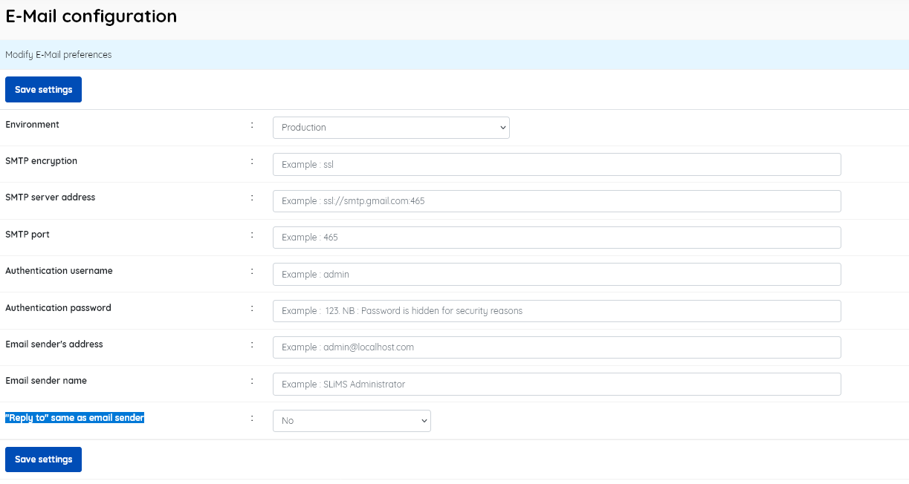

* ### E-Mail configuration

  ------

  This menu item allows the setting of preferences for E-Mail. 

  Enabling connection to an SMTP server will permit issuing of notices to library members via email.

  * **Environment** [Production/Development] (default=Production)
  * **SMTP encryption** - *specify the encryption used for the connection*
  * **SMTP server address** - *specify the address of the mail server that will send your emails*
  * **SMTP port** - *specify the port you will connect to on the server*
  * **Authentication username** - *specify the username you will use to connect to the server*
  * **Authentication  password** - *specify the password associated with the username above for the connection*
  * **Email sender's address** - *specify the email address that the email is sent by*
  * **Email sender name** - *specify the name that appears as sender in the email*
  * **"Reply to" same as email sender**[Yes/No] - *choose if the "Reply To" name is different

Don't forget to SAVE settings before leaving the page

