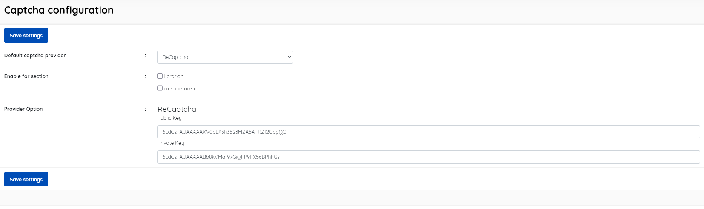

### Captcha configuration

------

This menu item allows the setting Captcha security if desired. This can be important in preventing automated logon attempts for public SLiMS OPACS. SLiMS installations that are not exposed to the Internet will have less requirement for this.

The available settings are:

* **Default captcha provider**  (default = ReCaptcha).  *In v.9.7.2 only ReCaptcha is offered*.

* **Enable for section** [Choose for *librarian* and/or *memberarea*] . Sections enabled will require Recaptcha response at login. 

* **Provider Option** : Enter Public key and Private key.  These will need to be generated for your specific domain. See https://developers.google.com/recaptcha/intro

  

Be sure to click **Save Settings** before exiting.

