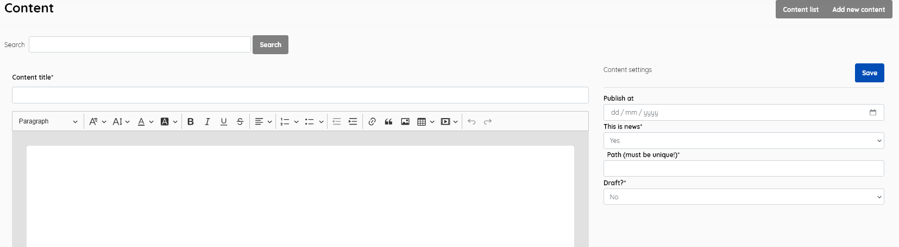

### Content

------

This menu enables the generation and management of web content that appears in certain sections of the SLiMS OPAC  and Admin interface. Examples include *Help on Use, Library Information, Welcome to Admin Page, Header Info*, and *News*.

**Content List**

 It  displays the list of content pages stored in the content table , with data for:

- **Content title** : A user-friendly title for the page e.g *Welcome to Admin Page*
- **Path ** : This must be unique e.g *adminhome*
- **Last updated**: shows time of last update

  

This section is provided with facilities to DELETE, ADD, and EDIT content data.

If you wish to edit an entry you must select it , click the little edit pen button, and then on the resulting screen also click the EDIT button to enable editing. It's a type of "safety mechanism".

A search function allows you to search for entries by content keywords.

Results can be sorted by clicking on the field name at the top of each column. 

##### Add new content

This provides the facility to add content in  the Senayan system. Content information includes the fields listed  above, with the exception of *Last updated*, which is done automatically when the **Save** button is clicked.

SLiMS does not translate content entries. Data is displayed as it has been entered.

SLiMS provides an online editor for the webpage content, including facilities for including images and media. This can be useful for providing news, and instructional materials to library members.

A date can be set for the publishing of the content, which will remain hidden until then. 

If you choose "*Yes*" ( the default ) for the field "**This is news**", the page will be displayed when OPAC users choose the News item from the main menu. 

The unique **path** name provides a way to refer to the content when designing templates etc.

There is an option to mark the content as **Draft**, so that it remains unpublished, for extended work/approval.

##### Delete content

Content page must be selected first, and after clicking the DELETE SELECTED DATA button a requester  will appear, asking for confirmation.

