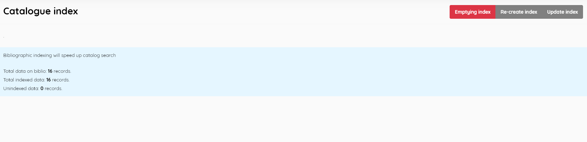

### Bibliographic indexes

------

This function is used to index the catalogue tables used by SLiMS. Given this indexing, the search performance of SLiMS will be improved.

There are three functions in this menu:
- **Emptying index** (clear the existing index results)

- **Re-create index** (re-index the catalogue data)

- **Update the index** (to index new bibliographic data that has not yet been indexed)

  

Data is also displayed, giving the total number of catalogued title records, the total of those that are indexed, and the number of unindexed records.

This index is used by the SLiMS SearchBiblioEngine.

You can locate the setting for Biblio Indexing type within *sysconfig.inc.php*. . This interracts also with the System Configuration Search engine option

