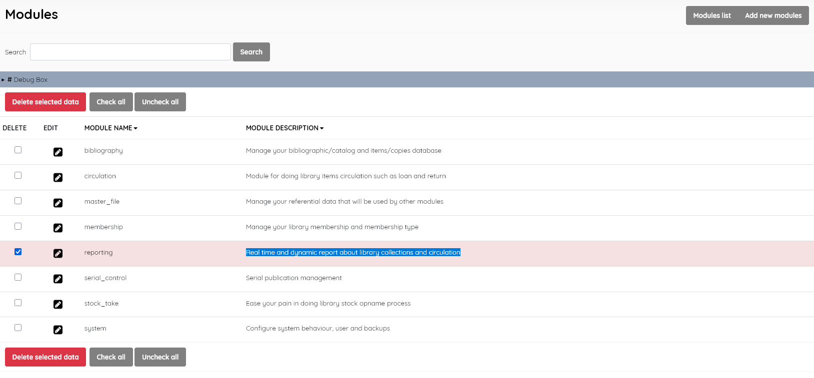

### Modules

------

Provides the functions of :
- **Module list** (listing existing modules)
- **Search** (search for a module)
- **Edit** and **Delete** modules
- **Add new modules** (add a module). 

The usual facility to sort the list by clicking on a field name is available.

To add a module, the new module folder containing the code must already be placed in the folder *admin/modules/*. Then click the **Add new modules** button, and fill in the information of the new module, namely: 
- *Module name* (the name of the module), 

- *Module path* (path/location of the module), 

- *Module description* (brief description of the module)

  

When the fields are completed, click the **Save** button

It's strongly suggested that you don't delete or significantly edit the module entries provided, because they provide SLiMS functions. The contents of the *Module description*s are not translated in SLiMS, and so these might be edited appropriately if your library administration is carried out in a language other than English.