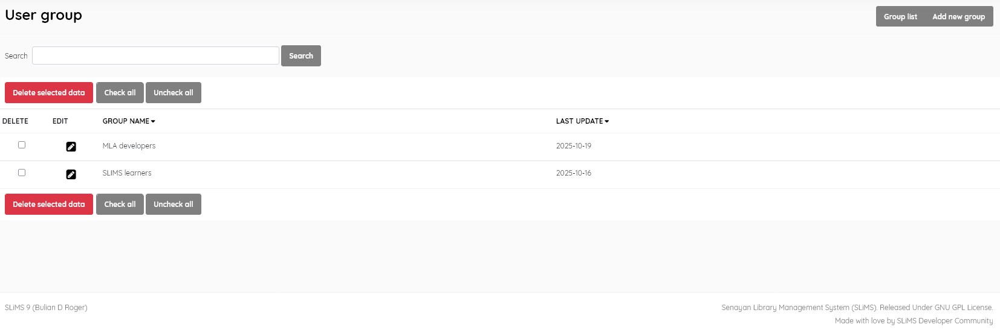
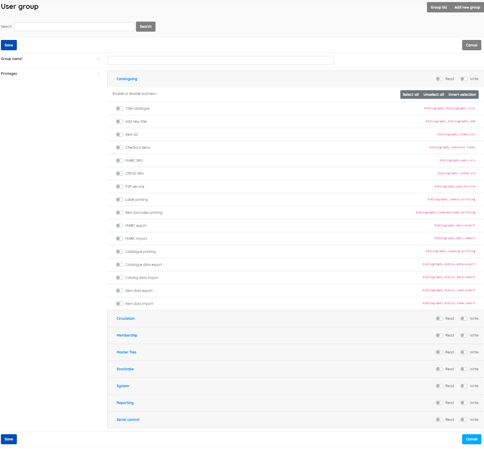

### User groups

------

A facility to define groups of users. In this you can create groupings of your system Admin users and grant read (Read) or Write (Write) permissions for the Senayan modules. Each user can be placed in more than one group.

Provides the functions of:

- **Group list** (listing existing security groups)
- **Search** (search for a group)
- **Edit** and **Delete** groups
- **Add new groups** (add a group). 

The usual facility to sort the list by clicking on a field name is available.

To add a group click the **Add new group** button, and fill in the information of the new group, namely: 

- *Group name* (the name of the group), 

- *Privileges*  (Both Modules and submenu item access controls are possible), 

- 

  When the selections are completed, click the **Save** button

  

This facility allows the System administrator to control  staff access to functions according to their skills and responsibilities.