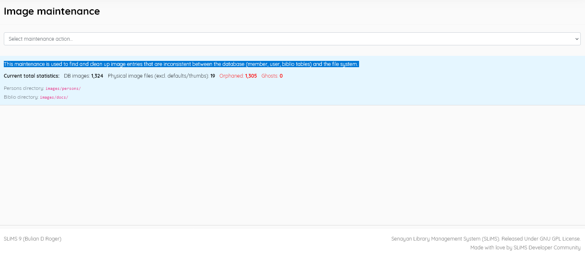
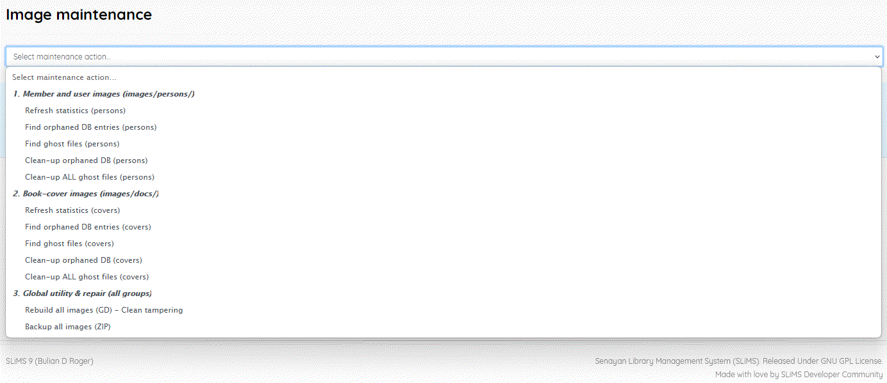

### Image maintenance

------

A facility to manage issues arising over time that create inconsistencies between the database and the file system in SLiMS. During the library's operation, some images and attached files, related to entries in the *member*, *user*, and *biblio* tables may be retained when entries are deleted. Such files can be termed "Ghosts".  Also some  such files may be deleted without a corresponding change in the relevant database field - creating "Orphaned"  entries.

This menu item displays statics related to this : 

You can select the following maintenance actions :

The normal practice with maintenance should be to follow the sequence

1. Refresh statistics
2. Find Orphans and Ghosts
3. Clean up

Image Maintenance also offers the option to Backup all images to a zip archive and this is a good practice to follow regularly, and certainly before  deleting "ghost" image files.

------

[//]: # " created by jim@burmastudy.org based on SLIMS 9.7.2   10/04/2026"

