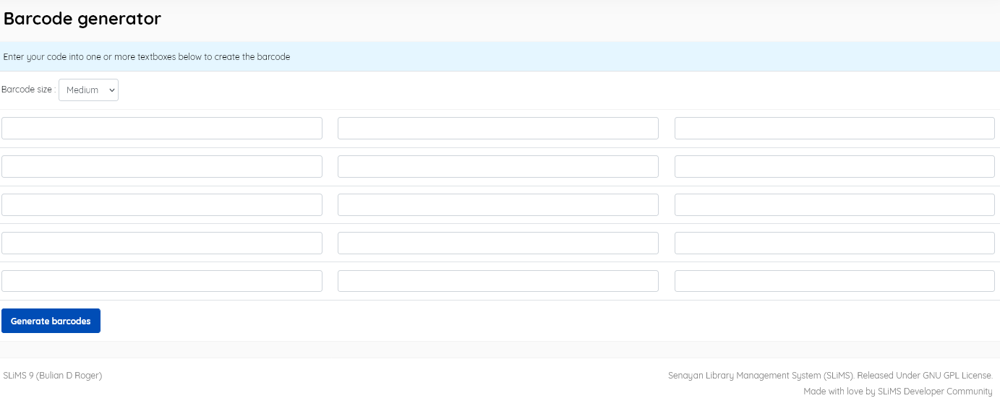

### Barcode generator

------

A simple utility to allow production of barcodes in addition to the "*Item Barcode Printing*"   and the "*Member card printing*" facilities.

Enter the code that will be made into barcodes in the columns on the screen. Determine the size of the barcode (Small, Medium, or Big), and click the **Generate barcode** button. Then these will be displayed in the form of a barcode , in a popup,  and can be printed in a printer. The default encoding used is barcode 128B. You can modify this barcode encoding in the Senayan global configuration file , *sysconfig.inc.php*.

*Note:*
The characters that can be processed in the Barcode generator are just the ASCII alphanumeric character set.

