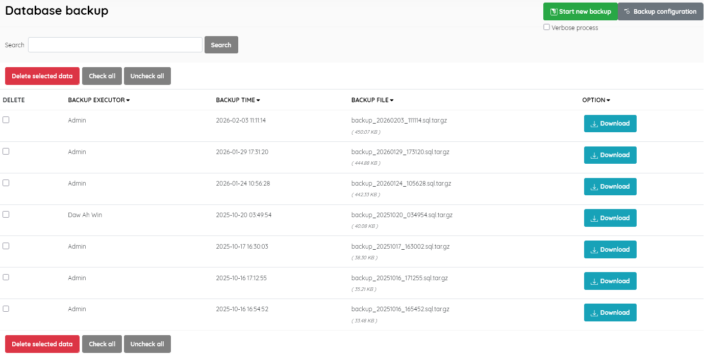
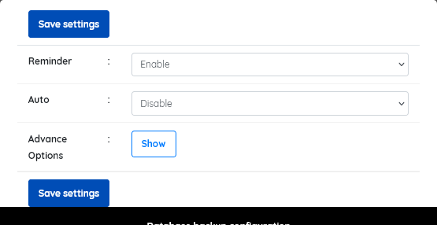

### Database backup

------

A facility to backup the SLiMS database. One of the most important facilities.

The screen displays details of existing backups, with fields as follows:

* **Backup executor** (the user who initiated the backup)
* **Backup time** (the time and date the backup was created)
* **Backup file location** (the path to the backup file and its name )
* **File size** (the size of the backup)

To create a backup, click the  **Start new backup** button and SLiMS will back up automatically. The format of backup files created by SLIMS is .sql in layout and compressed using TAR.GZ . They are named according to the creation date and store within  the directory *files/backup*.

Backup files can be downloaded by clicking the **Download** button.

Database backup can be configured by clicking the **Backup configuration** button. This will launch a popup showing settings for 

- **Reminder** [ Enable/Disable] (default=Enable) - *will show reminder on Admin Home Page*
- **Auto** [ Enable/Disable] ( default = Disable) - *can automate backup, but may lead to unnecessary backups and storage issues unless monitored*
- **Advanced Options** - it is strongly suggested that these are left unaltered unless you have special requirements and also have database administration expertise. The default settings will produce the best resulting SQL for most situations.

Unwanted backups can be deleted by selection using the checkbox, followed by clicking on the **Delete selected data** button.

The normal search and sort functions are available to manage a large number of backups.

------

**Backups should be carried out regularly and methodically according to a well-planned schedule.**

A general rule of thumb when determining when to back-up is to assess how much data you are prepared to lose, and be required to re-enter,  AND the possible consequences of lost data e,g lost circulation records.

When library staff log-in to SLiMS they will normally be advised if a daily backup has NOT been made, and if they have the correct permissions, they can initiate a backup directly from the Admin Home page.

A full database backup provides one of the key functions for migrating a SLiMS system to a new server, and for recovery from system failure, or major errors.

<u>Note:</u> 
*To do this backup, the mysql database user must have the right to LOCK TABLES*. This will be normally the case if the SLiMS installer has been used to create the SLiMS system.

<u>Note:</u>

*This function backs-up the SLiMS database only. Uploaded content such book covers images, attached files, member photos etc., must be backed-up separately.* The "Image maintenance" menu option provides a backup facility for **some** of these files.

