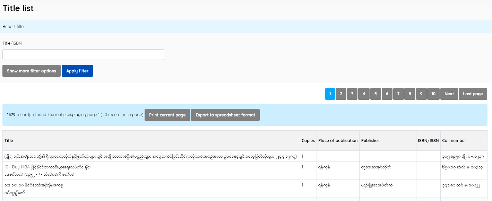
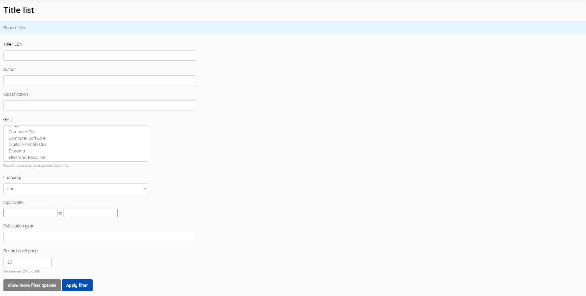

### Title List

------

Contains reports/lists of titles held by the library.

Information displayed is:

- *Title*

- *Copies*

- *Place of publication*

- *Publisher*

- *ISBN*

- *Call number*

  

In this menu there is a facility to sort and print, as well as a collection of desired filters. In this menu, filtering can also be done by writing the Title/ISBN, or by other filters. You do this by clicking **Show More Filter Options**. Existing filters are: 

- *Title/ISBN*
- *Author* 
- *Classification* 
- *GMD* 
- *Input date*
- *Location* 

and the number of records output per page can be specified

------

*Note: a number of the other reports use a similar display, so screenshots are not currently included for them.*