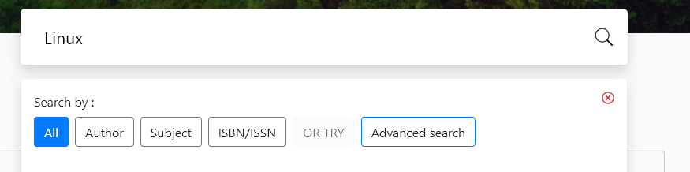
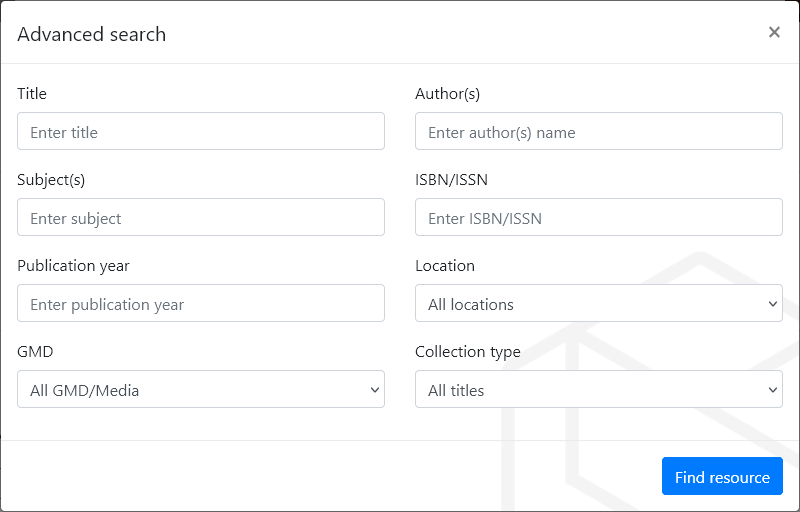

The default SLiMS Bulian OPAC presents a simple Search text box for users to begin to enter search terms. When text is entered additional option buttons appear, as below:

Users can simply press the Enter key, to search across the collection with the default "All" setting, or they can narrow the Search to just **Author**, or **Subject**, or **ISBN** fields.

More sophisticated searches can be accessed by clicking the **Advanced search** button.

This lets the user search more bibliographic fields as shown below:

