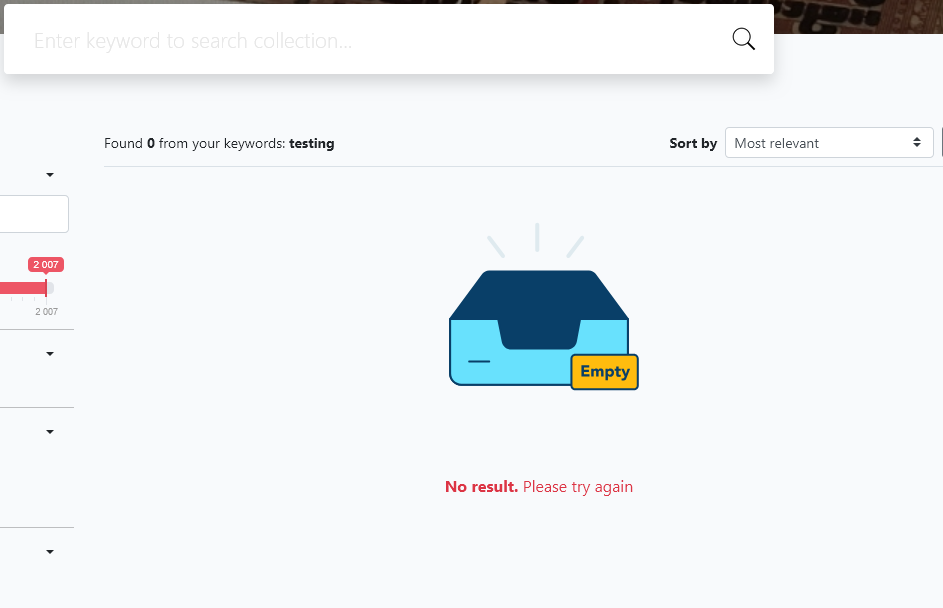
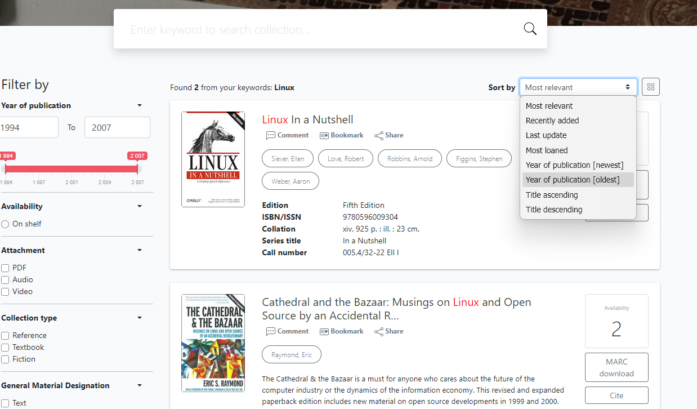
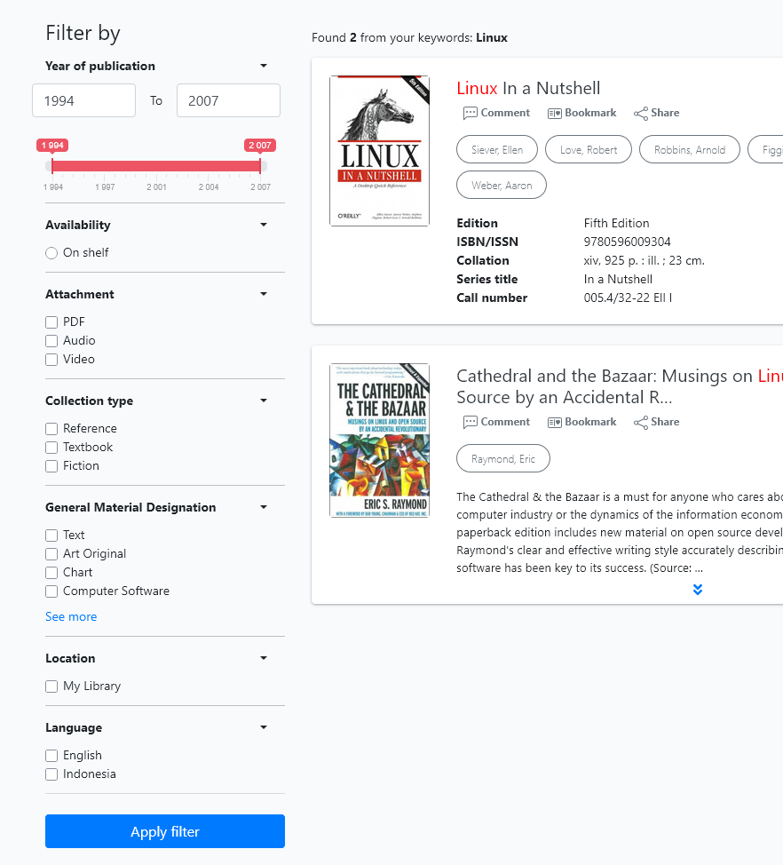
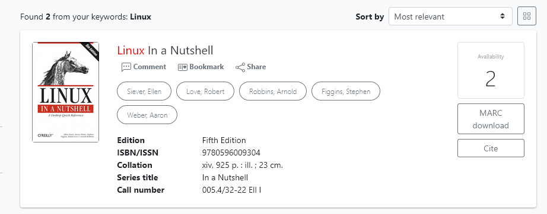
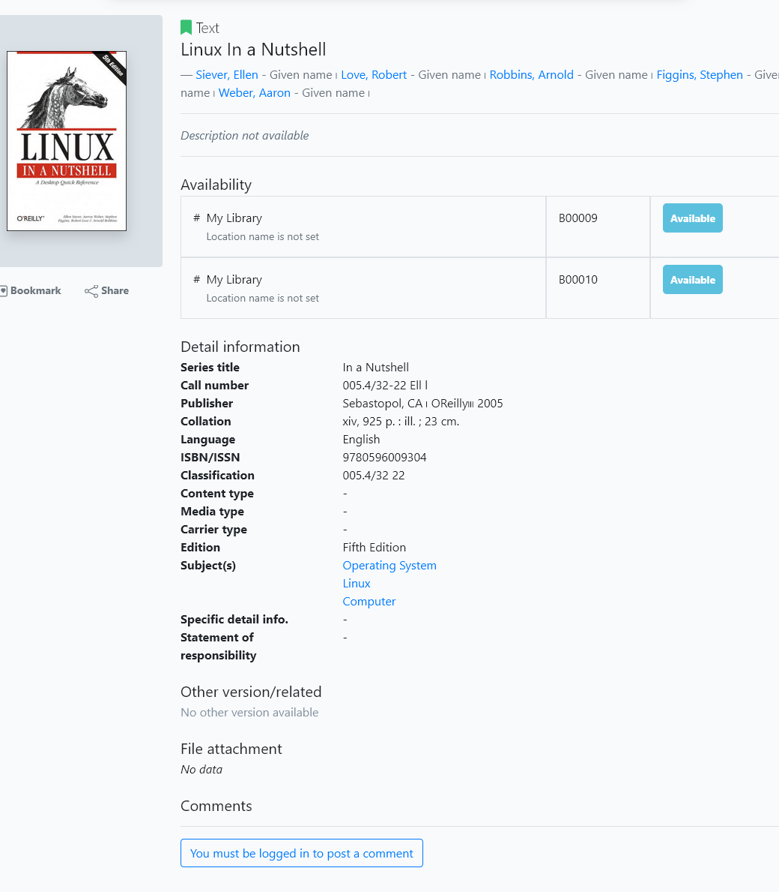

If no result is found from a search, the user is informed as below:

If results from a search are returned, the user has a number of options.

The default sorting of the returned results is by "*Most relevant*", but a number of other sorting criteria can be applied from the drop-down menu, as shown:

Results can also be filtered via a wide range of criteria, including  publication date-range, availability, whether there are attachments, the collection type, GMD, location, and language.

Each result presents a summary of cataloguing data of a title, an image of the title, and buttons for each author. Clicking an author button on a result will trigger a search for all additional titles by that author.

Clicking the **Availability** button ( which also displays the number of available copies), will **Add to Basket** that title, *IF* the library member is logged in. If they are not they will be redirected to the Member login.

Clicking the **MARC download** button will automatically download a MARC record  ( *.mrc ) to the user's default download location.

Clicking the **Cite** button will produce a pop-up with several bibliographic citations for the title in different formats. Users can cut and paste the result.

Clicking on a title in the results list will display full cataloguing data for that title, with its **Authors** and **Subjects** being hyperlinked to searches.

If the member is logged in they will be able to post comments / reviews for that title.  

Buttons are also provided to allow logged-in members to **Bookmark** the title for future use and to **Share** the title details on WhatsApp, Telegram, or via a copied link.

***Note:***  *the Akasia OPAC search results are similar but with some variation in features. Akasia lacks the variety of sorting and filtering options, the user Basket feature is not accessible , and the social media options are different*.